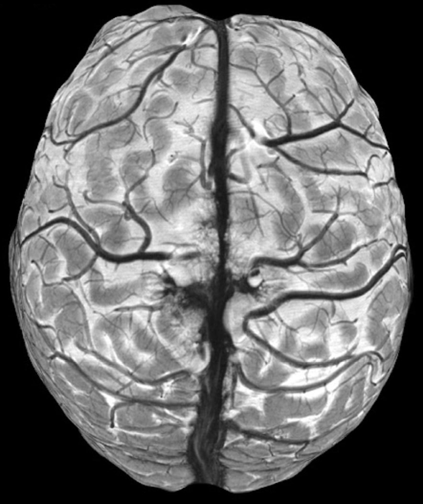

```{=html}
<section class="hero-cs column-screen" aria-labelledby="hero-title">
  <div class="hero-cs__media">
    
  </div>
  <div class="hero-cs__inner">
    <div class="hero-cs__panel">
      <!-- The accent rule must stay BEFORE the h1: Quarto lifts a first-child h1
           into its own title band when the page has no `title`. -->
      <div class="hero-cs__head">
        <span class="hero-cs__rule" aria-hidden="true"></span>
        <h1 id="hero-title" class="hero-cs__title"><span class="hero-cs__wipe">Mario Archila BRAINS Research Line</span></h1>
      </div>
      <p class="hero-cs__lede"><span class="brains-acronym">BRAINS</span> - <span class="brains-w"><span class="brains-i">B</span>iological</span> <span class="brains-w"><span class="brains-i">R</span>esearch</span> and <span class="brains-w"><span class="brains-i">A</span>rtificial</span> <span class="brains-w"><span class="brains-i">I</span>ntelligence</span> in <span class="brains-w"><span class="brains-i">N</span>eural</span> <span class="brains-w"><span class="brains-i">S</span>ystems</span>.</p>
      <a class="hero-cs__cta" href="research.html">Explore my research <span aria-hidden="true">→</span></a>
    </div>
  </div>
  <button class="hero-cs__toggle" type="button" aria-label="Pause background animation" hidden>
    <svg class="icon-pause" width="14" height="14" viewBox="0 0 14 14" aria-hidden="true" focusable="false"><rect x="2" y="1" width="3.5" height="12" rx="1" fill="currentColor"/><rect x="8.5" y="1" width="3.5" height="12" rx="1" fill="currentColor"/></svg>
    <svg class="icon-play" width="14" height="14" viewBox="0 0 14 14" aria-hidden="true" focusable="false"><path d="M3.5 1.5v11l9-5.5z" fill="currentColor"/></svg>
  </button>
</section>
<script>
(function () {
  var hero = document.querySelector('.hero-cs');
  if (!hero) return;
  if (window.matchMedia && window.matchMedia('(prefers-reduced-motion: reduce)').matches) return;
  document.documentElement.classList.add('ar-motion');
  var btn = hero.querySelector('.hero-cs__toggle');
  btn.hidden = false;
  btn.addEventListener('click', function () {
    var paused = hero.classList.toggle('is-paused');
    btn.setAttribute('aria-label', paused ? 'Play background animation' : 'Pause background animation');
  });
})();
</script>
```



## Research vision

I work at the interface of cognitive neuroscience and artificial intelligence, using computational and machine-learning methods to understand perception, memory, and cognition, and to translate those insights toward brain health.

::: {.card-grid}
::: {.card}
### Neuro-AI
Machine-learning models for the generation of stimuli to study human perception and modeling of neural and cognitive processes, with translational aims.
:::
::: {.card}
### Cognitive neuroscience methods
I use different methods, such as behaviour, electrophysiology, neuroimaging, and computational modeling, to answer research questions about human perception.
:::
::: {.card}
### Reproducible science
I use open software, pipelines, and data statements in all my work and publications.
:::
::: {.card}
### Method development
New acquisition and analysis methods, including ultra high-field 7 Tesla functional and structural MRI sequence optimization, for mesoscale (< 1 mm voxel resolution) research and clinical applications.
:::
:::

::: {.after-cards}
[Read more about my research →](research.qmd)
:::

## Explore

[Publications](publications.qmd) · [Teaching](teaching.qmd) · [Code & Data](code-data.qmd) · [Collaborations](collaborations.qmd) · [Sci-Comm](sci-comm.qmd) · [About](about.qmd) · [Contact](contact.qmd)
